Build a Single Page Application (SPA) with ASP.NET Web API and Angular.js using Azure Active Directory to log in users
=======================================================================================

In traditional web applications, the client (browser) initiates the communication with the server by requesting a page. The server then processes the request and sends the HTML of the page to the client. In subsequent interactions with the page –e.g. the user navigates to a link or submits a form with data– a new request is sent to the server, and the flow starts again: the server processes the request and sends a new page to the browser in response to the new action requested by the client.

In Single-Page Applications (SPAs) the entire page is loaded in the browser after the initial request, but subsequent interactions take place through Ajax requests. This means that the browser has to update only the portion of the page that has changed; there is no need to reload the entire page. The SPA approach reduces the time taken by the application to respond to user actions, resulting in a more fluid experience.

The architecture of a SPA involves certain challenges that are not present in traditional web applications. However, emerging technologies like ASP.NET Web API, JavaScript frameworks like AngularJS and new styling features provided by CSS3 make it really easy to design and build SPAs.

In this lab, you will take advantage of those technologies to implement Geek Quiz, a trivia website based on the SPA concept. You will first implement the service layer with ASP.NET Web API to expose the endpoints required to retrieve the quiz questions and store the answers. Then, you will build a rich and responsive UI using AngularJS and CSS3 transformation effects.

This lab includes the following tasks:

* [Adding a Global Administrator to your Active Directory](#adding-global-administrator-to-AAD)
* [Creating the Initial Project for Geek Quiz](#creating-the-initial-project-for-geek-quiz)
* [Creating the TriviaController Web API](#creating-the-triviacontroller-web-api)
* [Running the Solution](#running-the-solution)
* [Creating the SPA Interface Using AngularJS](#creating-the-spa-interface-using-angularjs)
* [Running the Single Page Application](#running-the-single-page-application)
* [Creating a Flip Animation Using CSS3](#creating-a-flip-animation-using-css3)
* [Deploying the Application to Azure](#deploying-the-app-to-azure)

<a name="adding-global-administrator-to-AAD" />
## Adding a Global Administrator to your Active Directory

Microsoft ASP.NET tools for Windows Azure Active Directory makes it simple to enable authentication for web applications hosted on [Windows Azure Web Sites](http://www.windowsazure.com/en-us/home/features/web-sites/). You can use Windows Azure Authentication to authenticate Office 365 users from your organization, corporate accounts synced from your on-premise Active Directory or users created in your own custom Windows Azure Active Directory domain. Enabling Windows Azure Authentication configures your application to authenticate users using a single [Windows Azure Active Directory](http://www.windowsazure.com/en-us/home/features/identity/) tenant.

1. Sign in to the [Azure Management Portal](https://manage.windowsazure.com/).
2. Most Azure accounts contain a **Default Directory**. You can find if yours does by clicking the **Active Directory** option on the sidebar that is on left side of the page.
	If you do not have a default directory, follow the instructions in the note to create one.

	> **Note:** If your suscription does not have the **Default Directory** or you want to create one, click the **Add Directory** option. 

	>

	> _Creating new Active Directory_

	> Alternatively, you can click the **NEW** button at the bottom bar, select **App Services**, **Active Directory**, **Directory**, and click **Custom Create**. This is shown in the following image.
	
	>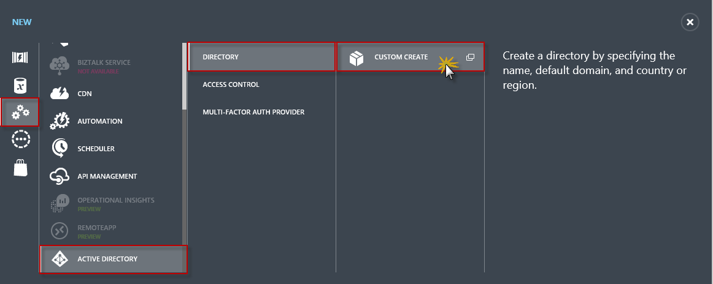
	
	> In the **Add directory** dialog, enter a name for your directory, a country or region, and a unique domain name. Finally, click the **check mark button** to create the directory.
	
	>

3. In the **Active Directory** page, click on your directory. 

	You will create a new user with the **Global Administrator** role. Click **Users** from the top menu, and then click the **Add User** button on the command bar.

	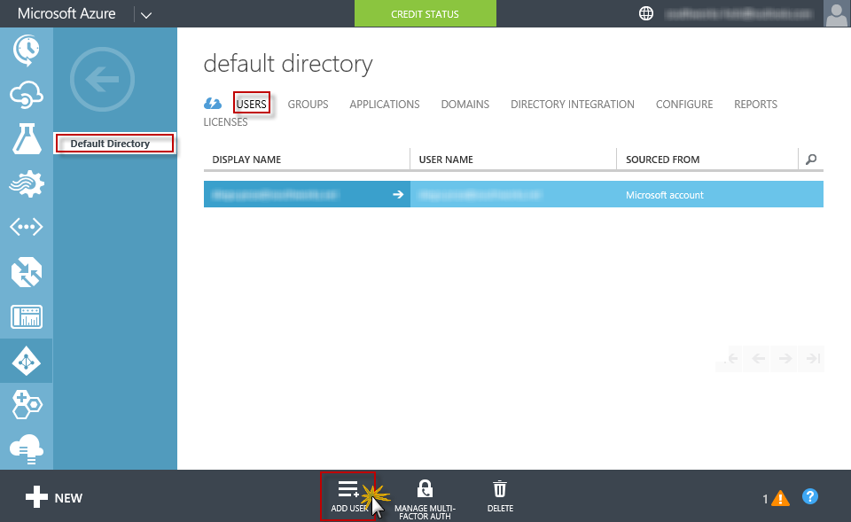
	
	_Adding an Active Directory User_
 
5. In the **Add User** dialog, enter a name for the new user and then click the right arrow.

	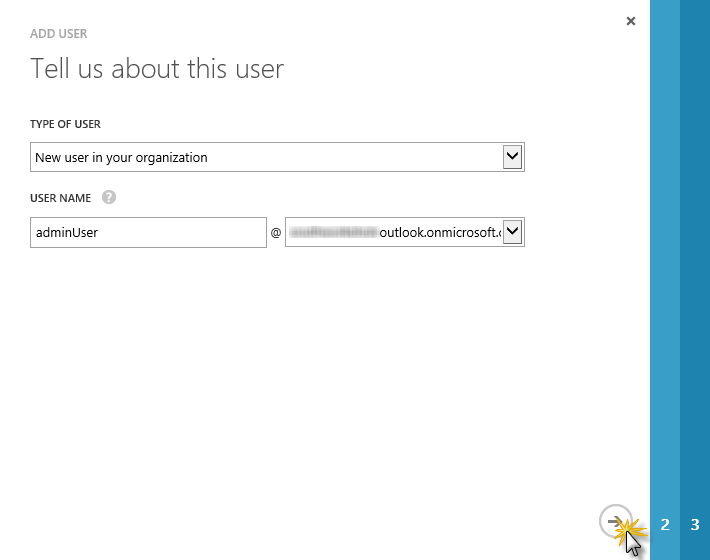
	
	_Add User dialog - Page 1_
	
6. Enter the user name and set the role to **Global Administrator**. Global administrators require an alternate email address for password recovery purposes. After you're finished, click the right arrow.

	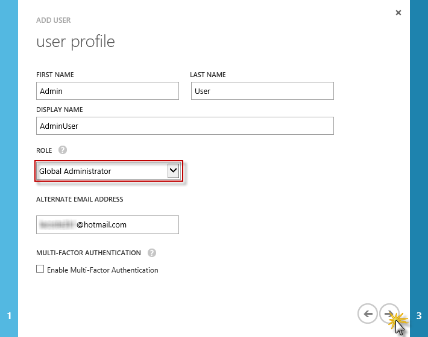
	
	_Add User dialog - Page 2_

7. On the next page of the dialog, click **Create**. A temporary password will be created for the new user and displayed in the dialog. 
	
	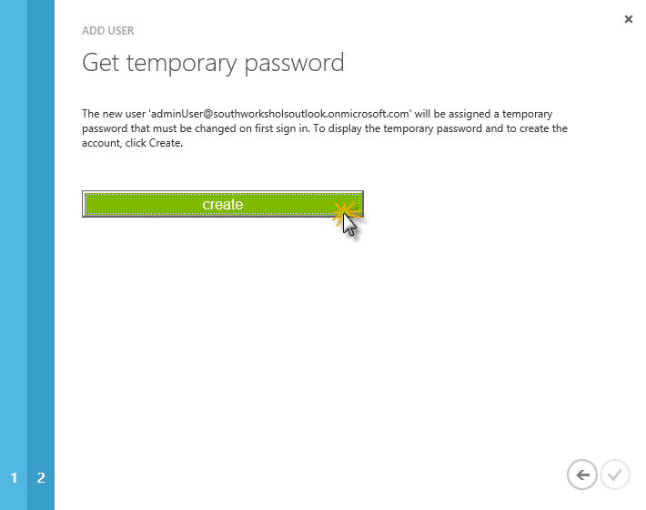
	
	_Add User dialog - Page 3_
	
	Note down the password. You will be required to change the password after the first log in. 

	

	The following image shows the new admin account. 
	
	> **Note:** You **must** use the Azure Active Directory to log into your app, **not the Microsoft account** also shown on this page.

	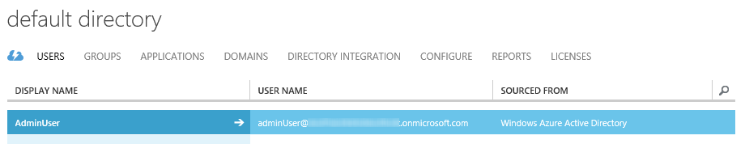
	
	_The new User_
	
<a name="creating-the-initial-project-for-geek-quiz" />
## Creating the Initial Project for Geek Quiz

In this task you will start creating a new ASP.NET MVC project with support for ASP.NET Web API. You will then add the Entity Framework's model classes and the database initializator to insert the quiz questions.

1. Open Visual Studio and from the **File** menu, hover over the **New** option and click **Project**.

    
    
    _Creating a New Project_

	> Note: You can open the end solution from end/Geek Quiz and configure it according to the instructions in [Setting up the end solution for Geek Quiz](end). 

2. In the **New Project** dialog box, select **ASP.NET Web Application** under the **Visual C# | Web** tab. Make sure **.NET Framework 4.5** is selected, name it GeekQuiz, choose a **Location** and click **OK**.

	> **Note:** You may also want to uncheck the **Add Application Insights to Project** if you don't want the functionality for your application. 

    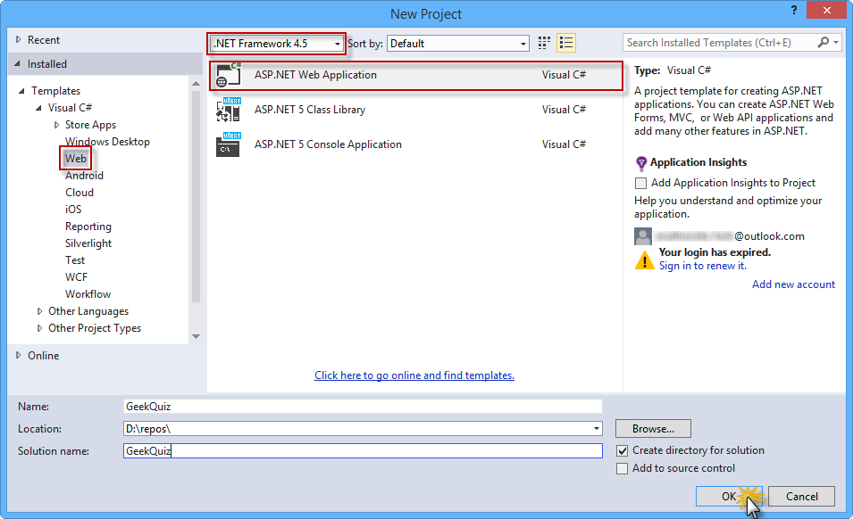
    
    _Creating a new ASP.NET Web Application project_

3. In the **New ASP.NET Project** dialog, select **MVC**. Make sure that the **Host in the cloud** option is also selected, and then click **Change Authentication**.

    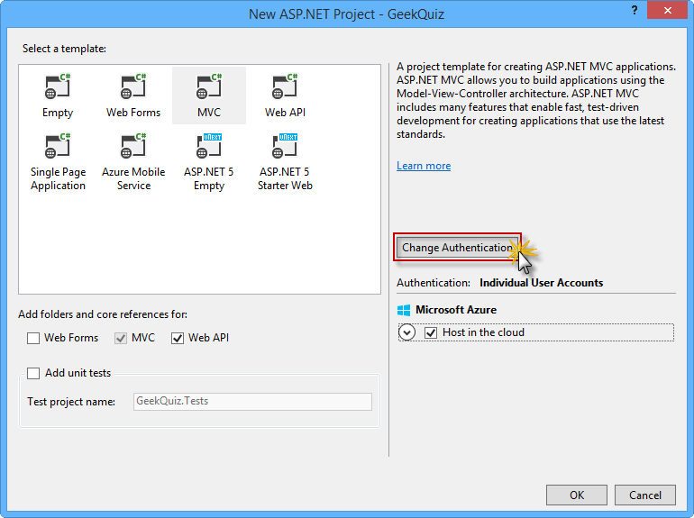
    
    _Creating a new project with the MVC template, including Web API components_

4. On the **Change Authentication** dialog, select **Organizational Accounts**. 

	These options can be used to automatically register your application with Azure AD as well as to automatically configure your application to integrate with Azure AD. You don't have to use the **Change Authentication** dialog to register and configure your application, but it makes it much easier. If you are using Visual Studio 2012 for example, you can still manually register the application in the Azure Management Portal and update its configuration to integrate with Azure AD.

	In the drop-down menus, select **Cloud - Single Organization** and **Single Sign On, Read directory data**. Enter the domain for your Azure AD directory (e.g. myADdomainoutlook.onmicrosoft.com) and then click **OK**. You can get the domain name from the Domains tab for the Default Directory on the azure portal (see the next image down).

    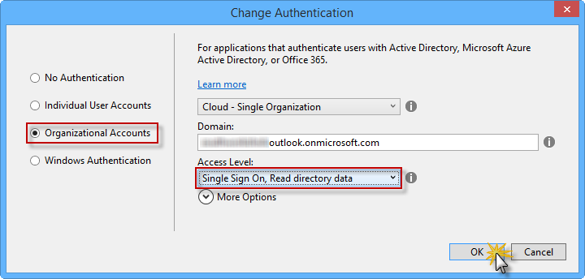
    
    _Changing Authentication_

	The following image shows the domain name from the Azure portal.

	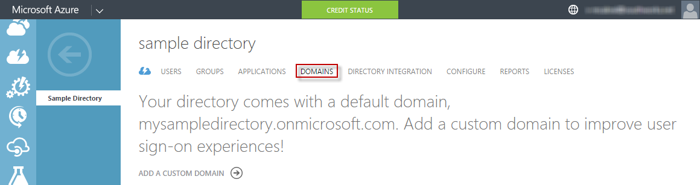
	
    _Azure Portal_
    
    > **Note:** You can optionally configure the Application ID URI that will be registered in Azure AD by clicking **More Options**. The App ID URI is the unique identifier for an application, which is registered in Azure AD and used by the application to identify itself when communicating with Azure AD. For more information about the App ID URI and other properties of registered applications, see [this topic](http://msdn.microsoft.com/en-us/library/azure/dn499820.aspx#BKMK_Registering <http://msdn.microsoft.com/en-us/library/azure/dn499820.aspx>). By clicking the checkbox below the App ID URI field, you can also choose to overwrite an existing registration in Azure AD that uses the same App ID URI.
    
5. After clicking **OK**, a sign-in dialog will appear, and you'll need to sign in using a Global Administrator account (not the Microsoft account associated with your subscription). If you created a new Administrator account earlier, you'll be required to change the password and then sign in again using the new password. 

	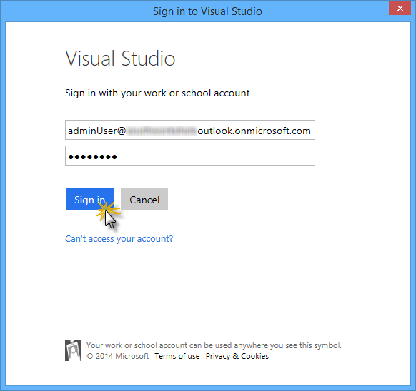
	
    _Signing in to Azure Active Directory_
    
6. After you've successfully authenticated, the **New ASP.NET Project** dialog will show your authentication choice (**Organizational Auth**) and the directory where the new application will be registered (_your_account_name_.onmicrosoft.com in the image below). Check the box for **Web API**. Click **OK**. 

	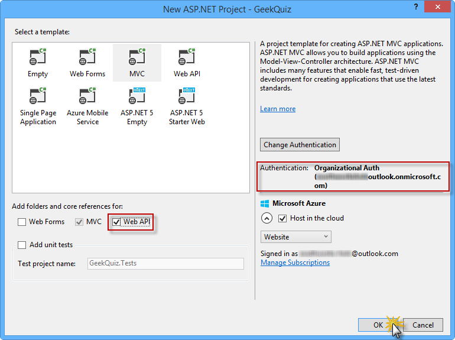
	
    _Authentication using Organizational Auth_
    
7. The **Configure Microsoft Azure Website** dialog will appear, using an auto-generated site name and region. Also note the account you're currently signed into in the dialog. You want to make sure that this account is the one that your Azure subscription is attached to, typically a Microsoft account.

	This project requires a database. You need to select one of your existing databases, or create a new one. A database is required because the project already uses a local database file to store a small amount of authentication configuration data. When you deploy the application to an Azure Website, this database isn't packaged with the deployment, so you need to choose one that's accessible in the cloud. Click **OK**.
	
	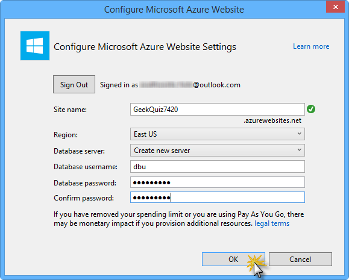
    
	_Configuring Microsoft Azure Website_
	
	The project will be created, and your authentication options and Azure Website options will be automatically configured with the project.

8. In **Solution Explorer**, right-click the **Models** folder of the **GeekQuiz** project and select **Add | Existing Item**....

    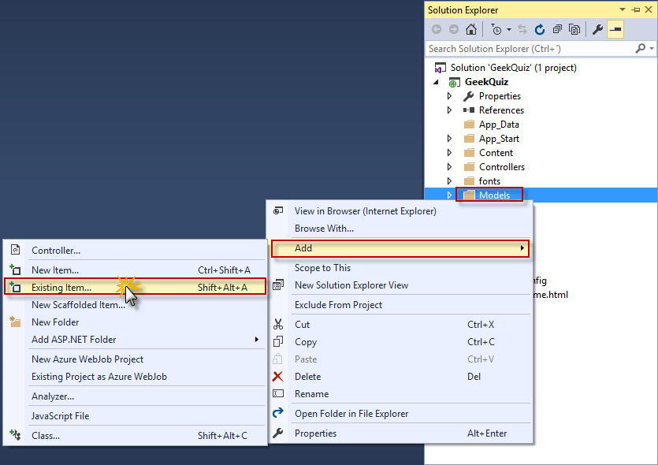
    
    _Adding an existing item_

9. In the **Add Existing Item** dialog box, navigate to the Source/Models folder and select all the files. Click **Add**.

    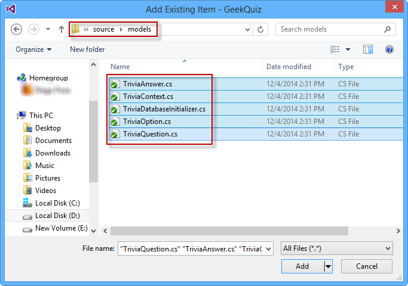
    
    _Adding the model assets_

	> **Note:** By adding these files, you are adding the data model, the Entity Framework's database context and the database initializer for the Geek Quiz application.

	**Entity Framework (EF)** is an object-relational mapper (ORM) that enables you to create data access applications by programming with a conceptual application model instead of programming directly using a relational storage schema. You can learn more about Entity Framework [here](https://entityframework.codeplex.com/).

	The following is a description of the classes you just added:

    * **TriviaOption:** represents a single option associated with a quiz question
    * **TriviaQuestion:** represents a quiz question and exposes the associated options through the **Options** property
    * **TriviaAnswer:** represents the option selected by the user in response to a quiz question
    * **TriviaContext:** represents the Entity Framework's database context of the Geek Quiz application. This class derives from **DbContext** and exposes **DbSet** properties that represent collections of the entities described above.
    * **TriviaDatabaseInitializer:** the implementation of the Entity Framework initializer for the **TriviaContext** class which inherits from **CreateDatabaseIfNotExists**. The default behavior of this class is to create the database only if it does not exist, inserting the entities specified in the **Seed** method.
    
10. Open the **Global.asax.cs** file and add the following using statement.

    ````C#
    using GeekQuiz.Models;
    ````

11. Update the **Application_Start** method, adding the sentence to set the **TriviaDatabaseInitializer** as the database initializer at the beginning, as shown below.
 
	<!-- mark:3 -->
    ````C#
	protected void Application_Start()
	{
	    System.Data.Entity.Database.SetInitializer(new TriviaDatabaseInitializer()); 

	    AreaRegistration.RegisterAllAreas();
	    GlobalConfiguration.Configure(WebApiConfig.Register);
	    FilterConfig.RegisterGlobalFilters(GlobalFilters.Filters);
	    RouteConfig.RegisterRoutes(RouteTable.Routes);
	    BundleConfig.RegisterBundles(BundleTable.Bundles);
	}
    ````

12. Now you will modify the **Home** controller to restrict access to authenticated users. To do this, open the **HomeController.cs** file inside the **Controllers** folder and add the **Authorize** attribute to the **HomeController** class definition.

    <!-- mark:3 -->
    ````C#
    namespace GeekQuiz.Controllers
    {
        [Authorize]
        public class HomeController : Controller
        {
            public ActionResult Index()
            {
                return View();
            }

            ...
        }
    }
    ````

    > **Note:** The **Authorize** filter checks to see if the user is authenticated. If the user is not authenticated, it returns HTTP status code 401 (Unauthorized) without invoking the action. You can apply the filter globally, at the controller level, or at the level of individual actions.

13. You will now customize the layout of the web pages and the branding. To do this, open the **_Layout.cshtml** file inside the **Views | Shared** folder and update the content of the `<title>` element by replacing _My ASP.NET Application_ with _Geek Quiz_.

    <!-- mark:4 -->
    ````HTML
    <head>
        <meta charset="utf-8" />
        <meta name="viewport" content="width=device-width, initial-scale=1.0">
        <title>@ViewBag.Title - Geek Quiz</title>
        @Styles.Render("~/Content/css")
        @Scripts.Render("~/bundles/modernizr")
    </head>
    ````

14. In the same file, update the navigation bar by removing the _About_ and _Contact_ links and renaming the _Home_ link to _Play_. Additionally, rename the _Application name_ link to _Geek Quiz_. The HTML for the navigation bar should look like the following code.

    <!-- mark:9,13 -->
    ````HTML
    <div class="navbar navbar-inverse navbar-fixed-top">
        <div class="container">
            <div class="navbar-header">
                <button type="button" class="navbar-toggle" data-toggle="collapse" data-target=".navbar-collapse">
                    <span class="icon-bar"></span>
                    <span class="icon-bar"></span>
                    <span class="icon-bar"></span>
                </button>
                @Html.ActionLink("Geek Quiz", "Index", "Home", null, new { @class = "navbar-brand" })
            </div>
            <div class="navbar-collapse collapse">
                <ul class="nav navbar-nav">
                    <li>@Html.ActionLink("Play", "Index", "Home")</li>
                </ul>
                @Html.Partial("_LoginPartial")
            </div>
        </div>
    </div>
    ````

15. Update the footer of the layout page by replacing _My ASP.NET Application_ with _Geek Quiz_. To do this, replace the content of the `<footer>` element with the following highlighted code.

    <!-- mark:5 -->
    ````HTML
    <div class="container body-content">
        @RenderBody()
        <hr />
        <footer>
            <p>&copy; @DateTime.Now.Year - Geek Quiz</p>
        </footer>
    </div>
    ````

<a name="creating-the-triviacontroller-web-api" />
##Creating the TriviaController Web API

In the previous task, you created the initial structure of the Geek Quiz web application. You will now build a simple Web API service that interacts with the quiz data model and exposes the following actions:

* **GET /api/trivia:** Retrieves the next question from the quiz list to be answered by the authenticated user.
* **POST /api/trivia:** Stores the quiz answer specified by the authenticated user.

You will use the ASP.NET Scaffolding tools provided by Visual Studio to create the baseline for the Web API controller class.

1. Open the **WebApiConfig.cs** file inside the **App_Start** folder. This file defines the configuration of the Web API service, like how routes are mapped to Web API controller actions.

2. Add the following using statement at the beginning of the file.

    ````C#
    using Newtonsoft.Json.Serialization;
    ````

3. Update the **Register** method to globally configure the formatter for the JSON data retrieved by the Web API action methods, as shown in the first sentence of the method (highlighted) below.

    <!-- mark:7-8 -->
    ````C#
    public static class WebApiConfig
    {
        public static void Register(HttpConfiguration config)
        {
            // Web API configuration and services

            // Use camel case for JSON data.
            config.Formatters.JsonFormatter.SerializerSettings.ContractResolver = new CamelCasePropertyNamesContractResolver();

            // Web API routes
            config.MapHttpAttributeRoutes();

            config.Routes.MapHttpRoute(
                name: "DefaultApi",
                routeTemplate: "api/{controller}/{id}",
                defaults: new { id = RouteParameter.Optional }
            );
        }
    }
    ````

    > **Note:** The **CamelCasePropertyNamesContractResolver** automatically converts property names to camel case, which is the general convention for property names in JavaScript.

4. In **Solution Explorer**, right-click the **Controllers** folder of the **GeekQuiz** project and select **Add | New Scaffolded** Item....

    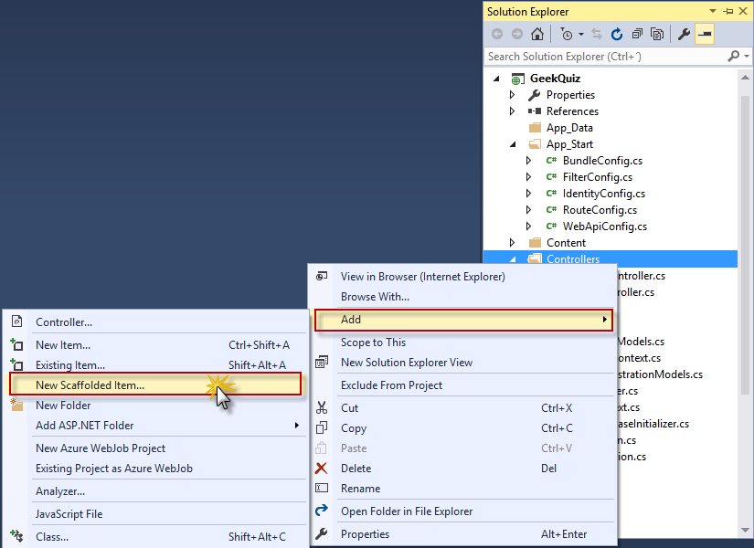
    
    _Creating a new scaffolded item_

5. In the **Add Scaffold** dialog box, make sure that the **Common** node is selected in the left pane. Then, select the **Web API 2 Controller - Empty** template in the center pane and click **Add**.

    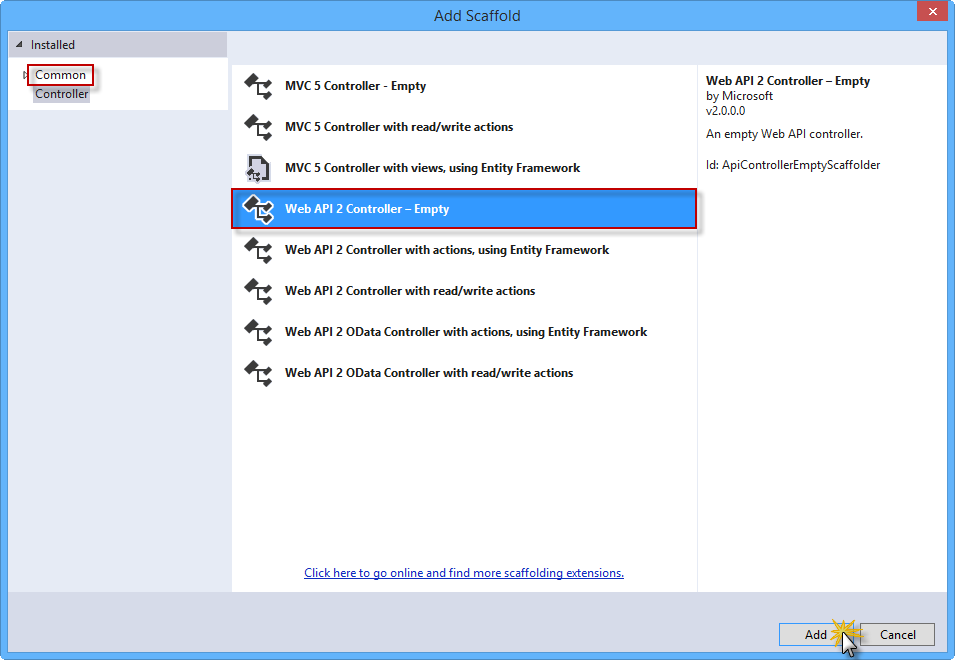
    
    _Selecting the Web API 2 Controller Empty template_

    > **Note:** **ASP.NET Scaffolding** is a code generation framework for ASP.NET Web applications. Visual Studio 2013 includes pre-installed code generators for MVC and Web API projects. You should use scaffolding in your project when you want to quickly add code that interacts with data models in order to reduce the amount of time required to develop standard data operations.

	The scaffolding process also ensures that all the required dependencies are installed in the project. For example, if you start with an empty ASP.NET project and then use scaffolding to add a Web API controller, the required Web API NuGet packages and references are added to your project automatically.

6. In the **Add Controller** dialog box, type TriviaController in the **Controller name** text box and click **Add**.

    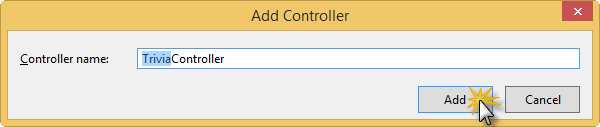
    
    _Adding the Trivia Controller_

7. The **TriviaController.cs** file is then added to the **Controllers** folder of the **GeekQuiz** project, containing an empty **TriviaController** class. Add the following using statements at the beginning of the file:

    ````C#
    using System.Data.Entity;
    using System.Threading;
    using System.Threading.Tasks;
    using System.Web.Http.Description;
    using GeekQuiz.Models;
    ````
    

8. Add the following code at the beginning of the **TriviaController** class, to define, initialize and dispose the **TriviaContext** instance in the controller.

    <!-- mark:3-13 -->
    ````C#
    public class TriviaController : ApiController
    {
        private TriviaContext db = new TriviaContext();

        protected override void Dispose(bool disposing)
        {
            if (disposing)
            {
                this.db.Dispose();
            }

            base.Dispose(disposing);
        }
    }
    ````

	> **Note:** The **Dispose** method of **TriviaController** invokes the **Dispose** method of the **TriviaContext** instance, which ensures that all the resources used by the context object are released when the TriviaContext instance is disposed or garbage-collected. This includes closing all database connections opened by Entity Framework.

9. Add the following helper method at the end of the **TriviaController** class. This method retrieves the following quiz question from the database to be answered by the specified user.
 
    ````C#
    private async Task<TriviaQuestion> NextQuestionAsync(string userId)
    {
        var lastQuestionId = await this.db.TriviaAnswers
            .Where(a => a.UserId == userId)
            .GroupBy(a => a.QuestionId)
            .Select(g => new { QuestionId = g.Key, Count = g.Count() })
            .OrderByDescending(q => new { q.Count, QuestionId = q.QuestionId })
            .Select(q => q.QuestionId)
            .FirstOrDefaultAsync();

        var questionsCount = await this.db.TriviaQuestions.CountAsync();

        var nextQuestionId = (lastQuestionId % questionsCount) + 1;
        return await this.db.TriviaQuestions.FindAsync(CancellationToken.None, nextQuestionId);
    }
    ````

10. Add the following **Get** action method to the **TriviaController** class. This action method calls the **NextQuestionAsync** helper method defined in the previous step to retrieve the next question for the authenticated user.
	
    ````C#
    // GET api/Trivia
    [ResponseType(typeof(TriviaQuestion))]
    public async Task<IHttpActionResult> Get()
    {
        var userId = User.Identity.Name;

        TriviaQuestion nextQuestion = await this.NextQuestionAsync(userId);

        if (nextQuestion == null)
        {
            return this.NotFound();
        }

        return this.Ok(nextQuestion);
    }
    ````

11. Add the following helper method at the end of the **TriviaController** class. This method stores the specified answer in the database and returns a Boolean value indicating whether or not the answer is correct.

    ````C#
    private async Task<bool> StoreAsync(TriviaAnswer answer)
    {
        this.db.TriviaAnswers.Add(answer);

        await this.db.SaveChangesAsync();
        var selectedOption = await this.db.TriviaOptions.FirstOrDefaultAsync(o => o.Id == answer.OptionId
            && o.QuestionId == answer.QuestionId);

        return selectedOption.IsCorrect;
    }
    ````

12. Add the following **Post** action method to the **TriviaController** class. This action method associates the answer to the authenticated user and calls the **StoreAsync** helper method. Then, it sends a response with the Boolean value returned by the helper method.

    ````C#
    // POST api/Trivia
    [ResponseType(typeof(TriviaAnswer))]
    public async Task<IHttpActionResult> Post(TriviaAnswer answer)
    {
        if (!ModelState.IsValid)
        {
            return this.BadRequest(this.ModelState);
        }

        answer.UserId = User.Identity.Name;

        var isCorrect = await this.StoreAsync(answer);
        return this.Ok<bool>(isCorrect);
    }
    ````

13. Modify the Web API controller to restrict access to authenticated users by adding the **Authorize** attribute to the **TriviaController** class definition.

    <!-- mark:1 -->
    ````C#
    [Authorize]
    public class TriviaController : ApiController
    {
        ...
    }
	````

<a name="running-the-solution" />
##Running the Solution

In this task you will verify that the Web API service you built in the previous task is working as expected. You will use the Internet Explorer F12 Developer Tools to capture the network traffic and inspect the full response from the Web API service.

> **Note:** Make sure that Internet Explorer is selected in the Start button located on the Visual Studio toolbar.

> 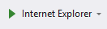

> _Internet Explorer option_

1. Press **F5** to run the solution. The Log in page should appear in the browser.

    > **Note:** When the application starts, the default MVC route is triggered, which by default is mapped to the Index action of the HomeController class. Since HomeController is restricted to authenticated users (remember that you decorated that class with the Authorize attribute previously) and there is no user authenticated yet, the application redirects the original request to the log in page.
	>
	> **Note 2:** The first time you run the application locally you may be prompted to trust the IIS Express SSL certificate. If so, click Yes and then accept the installation of the certificate. IIS Express is a lightweight, self-contained version of IIS optimized for developers, that Visual Studio uses when debugging local web applications. 

2. Enter the Active Directory credentials.

    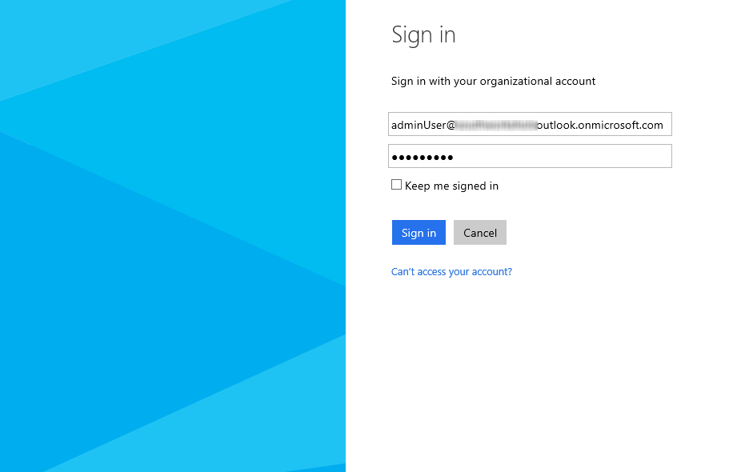
    
    _AD sign in screen_

3. After you have successfully logged in, the app will load the default action of the Home controller. Notice that the app shows the logged user at the top.

    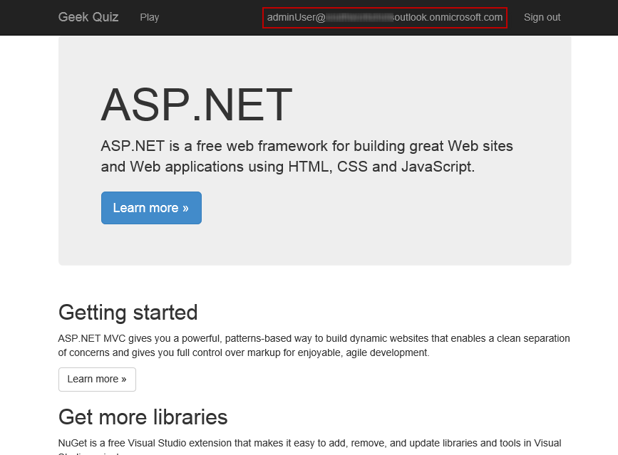
    
    _Running the solution_
    
4. Click the name of the signed-in user at the top right of the page. 

	This will take you to the **User Profile** page, which is an action on the Home Controller. You will notice that the table contains user information about the administrator account you created earlier. This information is stored in your directory, and the Graph API is called to retrieve this information when the page loads.

	> **Note:** The [Graph API](http://msdn.microsoft.com/en-us/library/azure/hh974476.aspx) is the programmatic interface used to perform CRUD and other operations on objects in your Azure AD directory. If you select an Organizational Account option for authentication when creating a new project in Visual Studio, your application will already be configured to call the Graph API.

	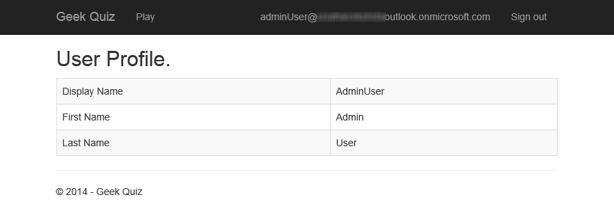
    
    _User Profile page_
    
5. Go back to Visual Studio and expand the **Controllers** folder and then open the **HomeController.cs** file. 

	You will see a **UserProfile()** action that contains code to retrieve a token and then call the Graph API. This code is duplicated below:

	<!-- mark:22 -->
	````C#
	[Authorize]
	public async Task UserProfile()
	{
		string tenantId = ClaimsPrincipal.Current.FindFirst(TenantIdClaimType).Value;

		// Get a token for calling the Windows Azure Active Directory Graph
		AuthenticationContext authContext = new AuthenticationContext(String.Format(CultureInfo.InvariantCulture, LoginUrl, tenantId));
		ClientCredential credential = new ClientCredential(AppPrincipalId, AppKey);
		AuthenticationResult assertionCredential = authContext.AcquireToken(GraphUrl, credential);
		string authHeader = assertionCredential.CreateAuthorizationHeader();
		string requestUrl = String.Format(
		    CultureInfo.InvariantCulture,
		    GraphUserUrl,
		    HttpUtility.UrlEncode(tenantId),
		    HttpUtility.UrlEncode(User.Identity.Name));

		HttpClient client = new HttpClient();
		HttpRequestMessage request = new HttpRequestMessage(HttpMethod.Get, requestUrl);
		request.Headers.TryAddWithoutValidation("Authorization", authHeader);
		HttpResponseMessage response = await client.SendAsync(request);
		string responseString = await response.Content.ReadAsStringAsync();
		UserProfile profile = JsonConvert.DeserializeObject<UserProfile>(responseString);

		return View(profile);
	}
	````

	To call the Graph API, you first need to retrieve a token. When the token is retrieved, its string value must be appended in the Authorization header for all subsequent requests to the Graph API. 

	Most of the code above handles the details of authenticating to Azure AD to get a token, using the token to make a call to the Graph API, and then transforming the response so that it can be presented in the View.
	The most relevant portion for discussion is the following (highlighted) line:

	`UserProfile profile = JsonConvert.DeserializeObject<UserProfile>(responseString);`

	This line represents the name of the user, which has been deserialized from the JSON response and is presented in the View.
You can call the Graph API using HttpClient and handle the raw data yourself, but an easier way is to use the [Graph Client Library](http://www.nuget.org/packages/Microsoft.Azure.ActiveDirectory.GraphClient/) which is available via NuGet. The Client Library handles the raw HTTP requests and the transformation of the returned data for you, and makes it much easier to work with the Graph API in a .NET environment. See the related Graph API code samples on [GitHub](https://github.com/AzureADSamples).

6. Switch back to the browser and browse back to the home page of the application.
7. In the browser, press **F12** to open the Developer Tools panel. Press **CTRL + 4** or click the Network icon, and then click the green play button to begin capturing network traffic.

    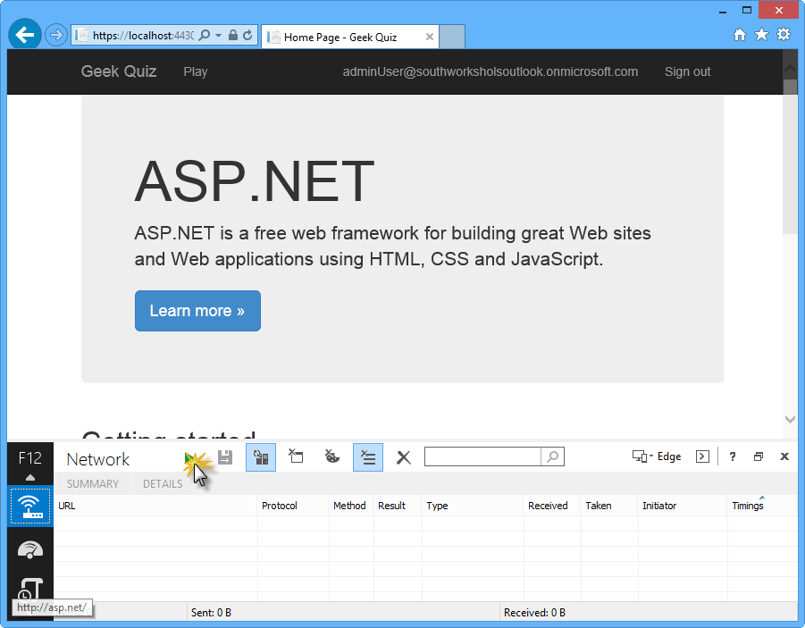
    
    _Initiating Web API network capture_

8. Append _api/trivia_ to the URL in the browser's address bar and hit **Enter**. You will now inspect the details of the response from the Get action method in TriviaController.

    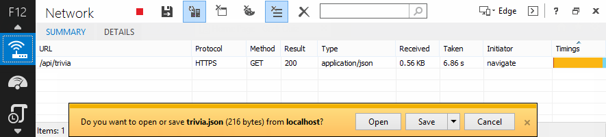
    
    _Retrieving the next question data through Web API_

	> **Note:** Once the download finishes, you will be prompted to make an action with the downloaded file. Leave the dialog box open in order to be able to watch the response content through the Developers Tool window.

9. Now you will inspect the body of the response. To do this, click the **Details** tab and then click **Response body**. 

	You can check that the downloaded data is an object with the properties options (which is a list of TriviaOption objects), id and title that correspond to the TriviaQuestion class.

    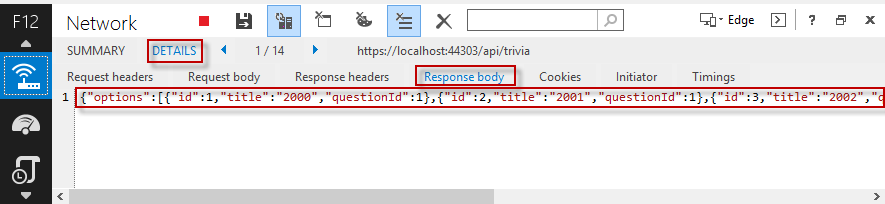
    
    _Viewing Web API Response Body_

10. Go back to Visual Studio and press **SHIFT + F5** to stop debugging.

<a name="creating-the-spa-interface-using-angularjs" />
## Creating the SPA Interface Using AngularJS

In this task you will use **AngularJS** to implement the client side of the Geek Quiz application. **AngularJS** is an open-source JavaScript framework that augments browser-based applications with Model-View-Controller (MVC) capability, facilitating both development and testing.

You will start by installing AngularJS from Visual Studio's **Package Manager Console**. Then, you will create the controller to provide the behavior of the Geek Quiz app and the view to render the quiz questions and answers using the AngularJS template engine.

> **Note:** For more information about AngularJS, refer to http://angularjs.org/.

1. Open the **Package Manager Console** from **Tools | Nuget Package Manager | Package Manager Console**. Type the following command to install the **AngularJS.Core** NuGet package.

    ````C#
    Install-Package AngularJS.Core
    ````
Wait until the package is downloaded and installed.

2. In the **Solution Explorer**, right-click the **Scripts** folder of the **GeekQuiz** project and select **Add | New Folder**. Name the folder **app** and press **Enter**.

3. Right-click the **app** folder you just created and select **Add | JavaScript** File.

    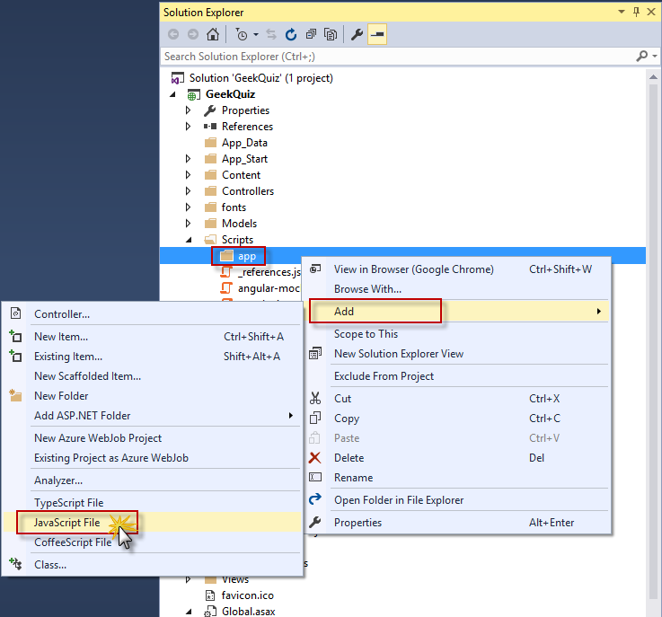
    
    _Adding a new JavaScript file_

4. In the **Specify Name for Item** dialog box, type _quiz-controller_ in the Item name text box and click OK.

    
    
    _Naming the new JavaScript file_

5. In the **quiz-controller.js** file, add the following code to declare and initialize the AngularJS **QuizCtrl** controller.

    <!-- mark:1-12 -->
    ````JS
    angular.module('QuizApp', [])
        .controller('QuizCtrl', function ($scope, $http) {
            $scope.answered = false;
            $scope.title = "loading question...";
            $scope.options = [];
            $scope.correctAnswer = false;
            $scope.working = false;

            $scope.answer = function () {
                return $scope.correctAnswer ? 'correct' : 'incorrect';
            };
        });
    ````
    
	> **Note:** The constructor function of the **QuizCtrl** controller expects an injectable parameter named **$scope**. The initial state of the scope should be set up in the constructor function by attaching properties to the **$scope** object. The properties contain the **view model**, and will be accessible to the template when the controller is registered.

	The **QuizCtrl** controller is defined inside a module named **QuizApp**. Modules are units of work that let you break your application into separate components. The main advantages of using modules is that the code is easier to understand and facilitates unit testing, reusability and maintainability.

6. You will now add behavior to the scope in order to react to events triggered from the view. Add the following code at the end of the **QuizCtrl** controller, to define the **nextQuestion** function in the **$scope** object.

    <!-- mark:4-19 -->
    ````JS
    .controller('QuizCtrl', function ($scope, $http) { 
        ...

        $scope.nextQuestion = function () {
            $scope.working = true;
            $scope.answered = false;
            $scope.title = "loading question...";
            $scope.options = [];

            $http.get("/api/trivia").success(function (data, status, headers, config) {
                $scope.options = data.options;
                $scope.title = data.title;
                $scope.answered = false;
                $scope.working = false;
            }).error(function (data, status, headers, config) {
                $scope.title = "Oops... something went wrong";
                $scope.working = false;
            });
        };
    };
    ````

	> **Note:** This function retrieves the next question from the **Trivia** Web API created in the previous task and attaches the question data to the **$scope** object.

7. Insert the following code at the end of the **QuizCtrl** controller to define the **sendAnswer** function in the **$scope** object.

    <!-- mark:4-15 -->
    ````JS
    .controller('QuizCtrl', function ($scope, $http) { 
        ...

        $scope.sendAnswer = function (option) {
            $scope.working = true;
            $scope.answered = true;

            $http.post('/api/trivia', { 'questionId': option.questionId, 'optionId': option.id }).success(function (data, status, headers, config) {
                $scope.correctAnswer = (Boolean(data) === true);
                $scope.working = false;
            }).error(function (data, status, headers, config) {
                $scope.title = "Oops... something went wrong";
                $scope.working = false;
            });
        };
    };
    ````
    
	> **Note:** This function sends the answer selected by the user to the **Trivia** Web API and stores the result –i.e. if the answer is correct or not– in the **$scope** object.

	The **nextQuestion** and **sendAnswer** functions, added in the previous steps, use the AngularJS **$http** object to abstract the communication with the Web API via the XMLHttpRequest JavaScript object from the browser. AngularJS supports another service that brings a higher level of abstraction to perform CRUD operations against a resource through RESTful APIs. The AngularJS **$resource** object has action methods which provide high-level behaviors without the need to interact with the **$http** object. Consider using the **$resource** object in scenarios that requires the CRUD model (for more information, see the [$resource documentation](http://docs.angularjs.org/api/ngResource/service/$resource)).

8. The next step is to create the AngularJS template that defines the view for the quiz. To do this, open the **Index.cshtml** file inside the **Views | Home** folder and replace the content with the following code.

	````HTML
    @{
        ViewBag.Title = "Play";
    }

    <div id="bodyContainer" ng-app="QuizApp">
        <section id="content">
            <div class="container" >
                <div class="row">
                    <div class="flip-container text-center col-md-12" ng-controller="QuizCtrl" ng-init="nextQuestion()">
                        <div class="back" ng-class="{flip: answered, correct: correctAnswer, incorrect:!correctAnswer}">
                            <p class="lead">{{answer()}}</p>
                            <p>
                                <button class="btn btn-info btn-lg next option" ng-click="nextQuestion()" ng-disabled="working">Next Question</button>
                            </p>
                        </div>
                        <div class="front" ng-class="{flip: answered}">
                            <p class="lead">{{title}}</p>
                            <div class="row text-center">
                                <button class="btn btn-info btn-lg option" ng-repeat="option in options" ng-click="sendAnswer(option)" ng-disabled="working">{{option.title}}</button>
                            </div>
                        </div>
                    </div>
                </div>
            </div>
        </section>
    </div>

    @section scripts {
        @Scripts.Render("~/Scripts/angular.js")
        @Scripts.Render("~/Scripts/app/quiz-controller.js")
    }
    ````

	> **Note:** The AngularJS template is a declarative specification that uses information from the model and the controller to transform static markup into the dynamic view that the user sees in the browser. The following are examples of AngularJS elements and element attributes that can be used in a template:
	* The **ng-app** directive tells AngularJS the DOM element that represents the root element of the application.
	* The **ng-controller** directive attaches a controller to the DOM at the point where the directive is declared.
	* The curly brace notation **{{ }}** denotes bindings to the scope properties defined in the controller.
	* The **ng-click** directive is used to invoke the functions defined in the scope in response to user clicks.
    
10. Open the **Site.css** file inside the **Content** folder and add the following styles at the end of the file, to provide a look and feel for the quiz view.

	````CSS
    .validation-summary-valid {
         display: none;
    }

    /* Geek Quiz styles */
    .flip-container .back,
    .flip-container .front {
         border: 5px solid #00bcf2;
         padding-bottom: 30px;
         padding-top: 30px;
    }

    #content {
        position:relative;
        background:#fff;
        padding:50px 0 0 0;
    }

    .option {
         width:140px;
         margin: 5px;
    }

    div.correct p {
         color: green;
    }

    div.incorrect p {
         color: red;
    }

    .btn {
         border-radius: 0;
    }

    .flip-container div.front, .flip-container div.back.flip {
        display: block;
    }

    .flip-container div.front.flip, .flip-container div.back {
        display: none;
    }
	````
  
<a name="running-the-single-page-application" />
##Running the Single Page Application

In this task you will execute the solution using the new user interface you built with AngularJS to answer some of the quiz questions.

1. Press **F5** to run the solution.

2. Enter your Active Directory credentials to log in.

3. The Home page should appear, showing the first question of the quiz. Answer the question by clicking one of the options. This will trigger the sendAnswer function defined earlier, which sends the selected option to the Trivia Web API.

    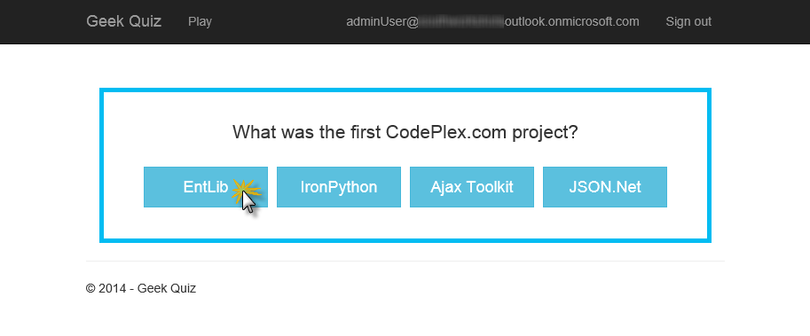
    
    _Answering a question_

4. After clicking one of the buttons, the answer should appear. Click Next Question to show the following question. This will trigger the nextQuestion function defined in the controller.

    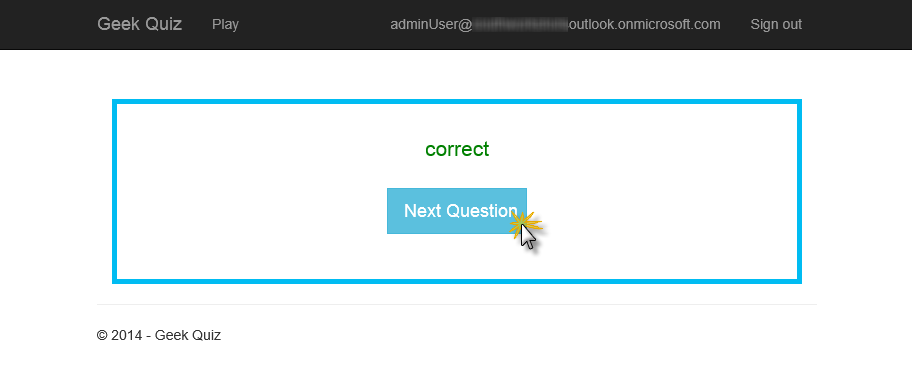
    
    _Requesting the next question_

5. The next question should appear. Continue answering questions as many times as you want. After completing all the questions you should return to the first question.

    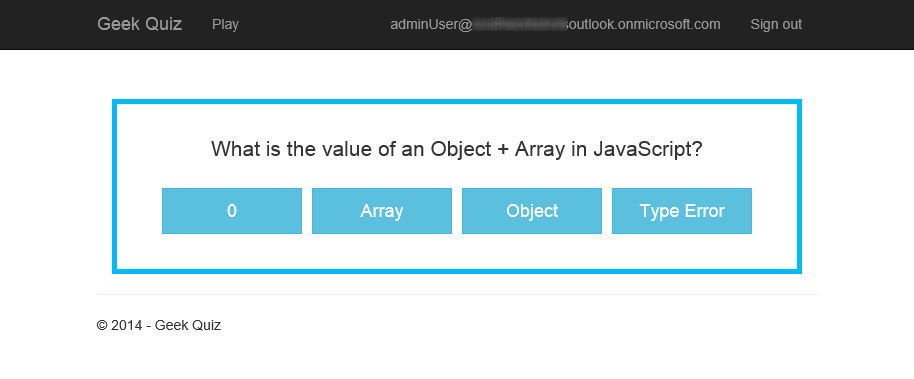
    
    _Next question_

6. Go back to Visual Studio and press **SHIFT + F5** to stop debugging.

<a name="creating-a-flip-animation-using-css3" />
##Creating a Flip Animation Using CSS3

In this task you will use CSS3 properties to perform rich animations by adding a flip effect when a question is answered and when the next question is retrieved.

1. In **Solution Explorer**, right-click the **Content** folder of the **GeekQuiz** project and select **Add | Existing Item...**.

    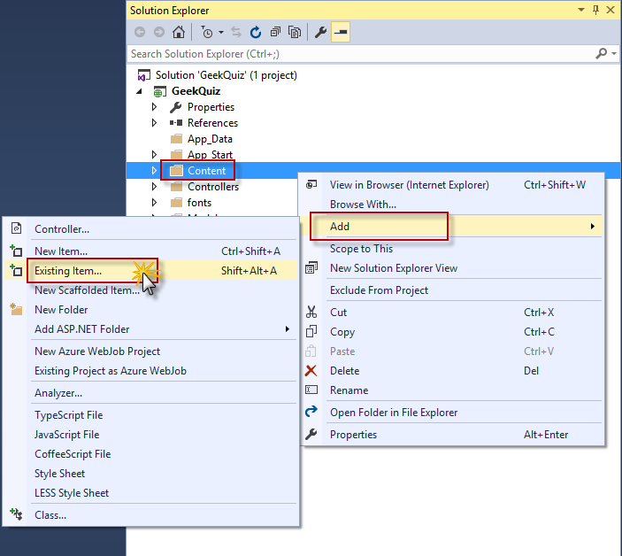

    _Adding an existing item to the Content folder_

2. In the **Add Existing Item** dialog box, navigate to the **Source/css** folder and select **Flip.css**. Click **Add**.

    

    _Adding the Flip.css file from Assets_

3. Open the **Flip.css** file you just added and inspect its content.

4. Locate the **flip transformation** comment. The styles below that comment use the CSS **perspective** and **rotateY** transformations to generate a "card flip" effect.

    ````CSS
    /* flip transformation */
    .flip-container div.front {
        -moz-transform: perspective(2000px) rotateY(0deg);
        -webkit-transform: perspective(2000px) rotateY(0deg);
        -o-transform: perspective(2000px) rotateY(0deg);
        transform: perspective(2000px) rotateY(0deg);
    }

	.flip-container div.front.flip {
		-moz-transform: perspective(2000px) rotateY(179.9deg);
		-webkit-transform: perspective(2000px) rotateY(179.9deg);
		-o-transform: perspective(2000px) rotateY(179.9deg);
		transform: perspective(2000px) rotateY(179.9deg);
	}

    .flip-container div.back {
        -moz-transform: perspective(2000px) rotateY(-180deg);
        -webkit-transform: perspective(2000px) rotateY(-180deg);
        -o-transform: perspective(2000px) rotateY(-180deg);
        transform: perspective(2000px) rotateY(-180deg);
    }

	.flip-container div.back.flip {
		-moz-transform: perspective(2000px) rotateY(0deg);
		-webkit-transform: perspective(2000px) rotateY(0deg);
		-ms-transform: perspective(2000px) rotateY(0);
		-o-transform: perspective(2000px) rotateY(0);
		transform: perspective(2000px) rotateY(0);
	}
    ````

5. Locate the **hide back of pane during flip** comment. 

	The style rule below the comment hides the back-side of the faces when they are facing away from the viewer by setting the **backface-visibility** CSS property to hidden.

    ````CSS
    /* hide back of pane during flip */
    .front, .back {
        -moz-backface-visibility: hidden;
        -webkit-backface-visibility: hidden;
        backface-visibility: hidden;
    }
    ````

6. Open the **BundleConfig.cs** file inside the **App_Start** folder and add the reference to the **Flip.css** file in the **"~/Content/css"** style bundle.

    ````C#
    bundles.Add(new StyleBundle("~/Content/css").Include(
        "~/Content/bootstrap.css",
        "~/Content/site.css",
        "~/Content/Flip.css"));
    ````

7. Press **F5** to run the solution and log in with your credentials.

8. Answer a question by clicking one of the options. Notice the flip effect when transitioning between views.

    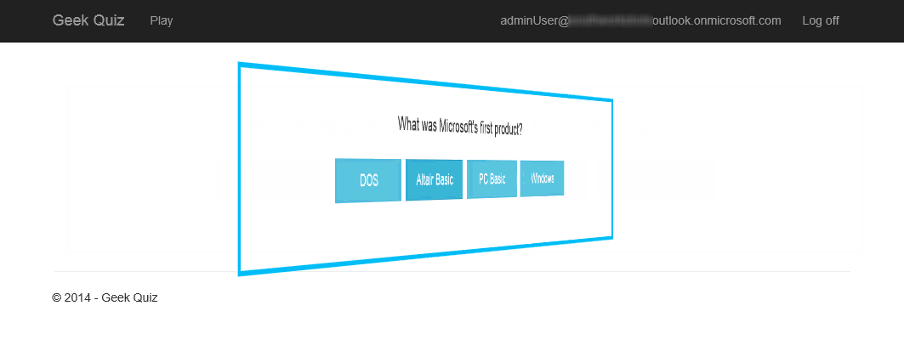
    
    _Answering a question with the flip effect_

9. Click **Next Question** to retrieve the following question. The flip effect should appear again.

    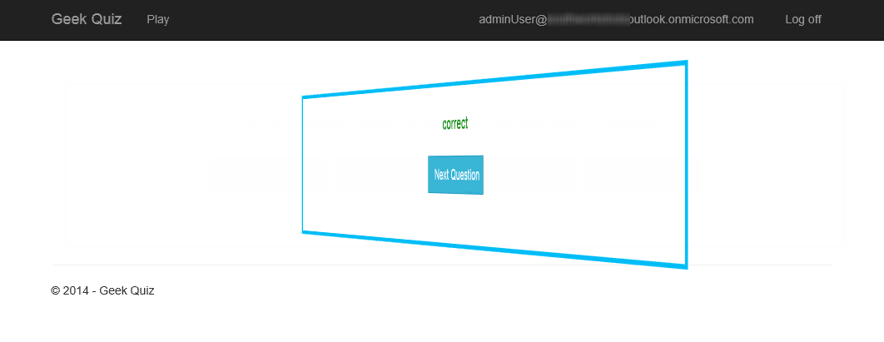
    
    _Retrieving the following question with the flip effect_

10. Go back to Visual Studio and press **SHIFT + F5** to stop debugging.


<a name="deploying-the-app-to-azure" />
##Deploying the Application to Azure

The following steps will show you how to deploy the application to Azure as an Azure Website. In the earlier steps, you connected your new project with an Azure Website, so it's ready to be published easily.

1. In Visual Studio, right-click on the project and select **Publish**. 

	The **Publish Web** dialog will appear with each setting already configured. 

1. Click on the **Next** button to go to the **Settings** page. You may be prompted to authenticate; make sure you authenticate using your Azure subscription account (typically a Microsoft account) and not the organizational account you created earlier.

    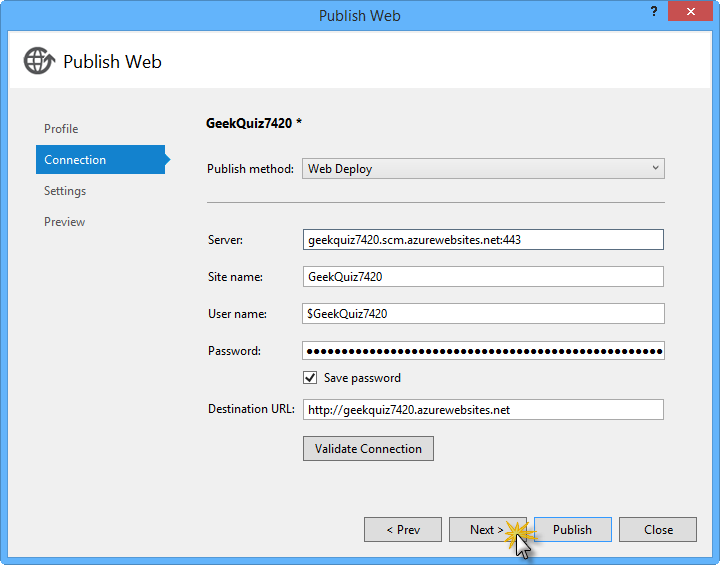
    
    _Publish Web dialog - Connection tab_

2. Check the **Enable Organizational Authentication** option. In the **Domain** field, enter the domain for your directory. From the **Access Level** drop-down, select **Single Sign On, Read directory data**. You will notice that the previous database you used is already populated in the **Databases** section. Click **Publish**.

    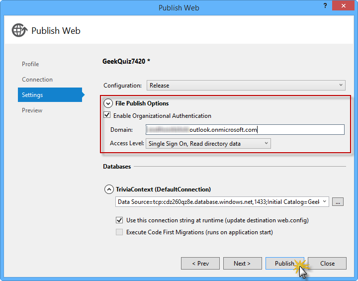
    
    _Publish Web dialog - Settings tab_

3. Visual Studio will begin deploying your website, and then a new browser window will appear. You may be prompted to authenticate to your directory once again. 

	Once you've authenticated, you'll be redirected to your newly published website on Azure.

    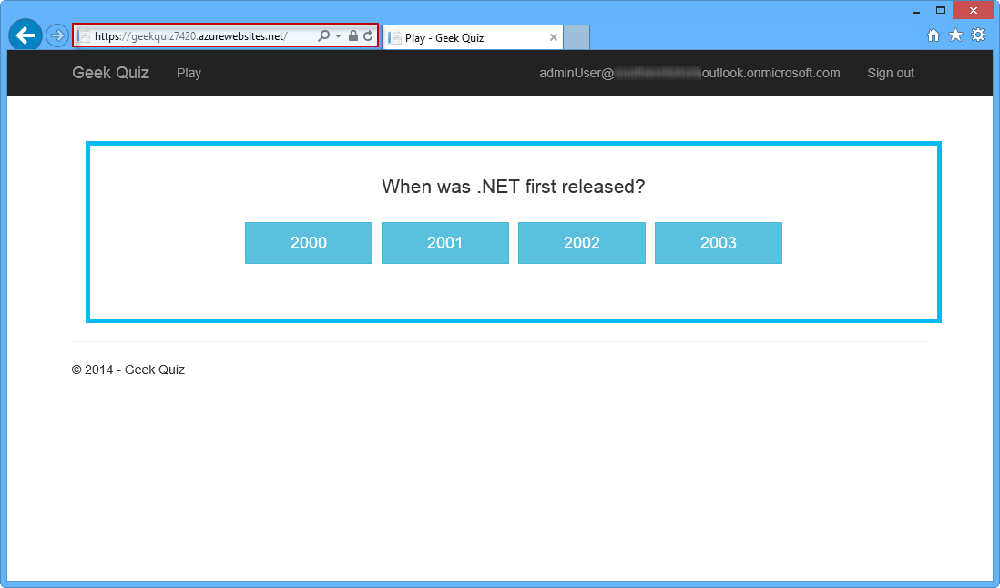
    
    _Geek Quiz published in Azure_

4. If you get an error when running the app in Azure, replace the code in the _Views\Shared\_LoginPartial.cshtml_ file with the following and publish the project again.

	<!-- mark:1-8,15 -->
	````HTML
	@{
	   var user = "Null User";
	   if (!String.IsNullOrEmpty(User.Identity.Name))
	   {
	      user = User.Identity.Name;
	   }

	}

	@if (Request.IsAuthenticated)
	{
	    <text>
		 <ul class="nav navbar-nav navbar-right">
		    <li>
		       @Html.ActionLink(user, "UserProfile", "Home", routeValues: null, htmlAttributes: null)
		    </li>
		    <li>
			@Html.ActionLink("Sign out", "SignOut", "Account")
		    </li>
		</ul>
	    </text>
	}
	else
	{
	     <ul class="nav navbar-nav navbar-right">
		<li>@Html.ActionLink("Sign in", "Index", "Home", routeValues: null, htmlAttributes: new { id = "loginLink" })</li>
	    </ul>
	}
	````

	> **Note:** After running the app, if the logged in user shows "Null User", sign out, and sign back in with the Active Directory account you created earlier. 

##Summary

By completing this lab you have learned how to:

* Create a Global Account Administrator user in Azure Active Directory
* Create an ASP.NET Web API controller using ASP.NET Scaffolding
* The Graph API works
* Implement a Web API Get action to retrieve the next quiz question
* Implement a Web API Post action to store the quiz answers
* Install AngularJS from the Visual Studio Package Manager Console
* Implement AngularJS templates and controllers
* Use CSS3 transitions to perform animation effects
* Deploy your application to Microsoft Azure

