# Get started with Azure Websites and ASP.NET

This lab shows how to create an ASP.NET web application and deploy it to an Azure Website by using Visual Studio 2015 Preview. It assumes that you have no prior experience using Azure or ASP.NET. On completing the lab, you will have a simple web application up and running in the cloud.

This lab includes the following sections:

1. [Create an ASP.NET web application in Visual Studio](#create-an-aspnet-web-application)
1. [Deploy the application to Azure](#deploy-the-application-to-azure)
1. [Make a change and redeploy](#make-a-change-and-redeploy)
1. [Monitor and manage the site in the management portal](#monitor-and-manage-the-site-in-the-management-portal)

## Create an ASP.NET web application

In this task you will create the web application that is going to be used throughout this lab.

1. Open Visual Studio. From the **File** menu, hover over the **New** option and click **Project**.

	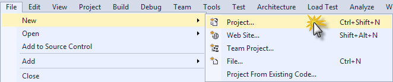
	
    _New Project in File menu_

2. In the **New Project** dialog box, expand **C#** and select **Web** under **Installed Templates**, and then select **ASP.NET Web Application**.

3. Name the application **ContactManager** and click **OK**.

	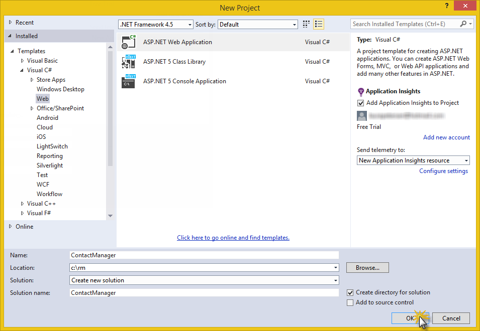
	
    _New Project dialog box_

	>**Note:** Make sure you enter "ContactManager". Code blocks that you will be copying later assume that the project name is ContactManager.

4. In the **New ASP.NET Project** dialog box, select the **MVC** template. Verify **Authentication** is set to **Individual User Accounts**, **Host in the cloud** is checked and **Website** is selected. Then, click **OK**.

	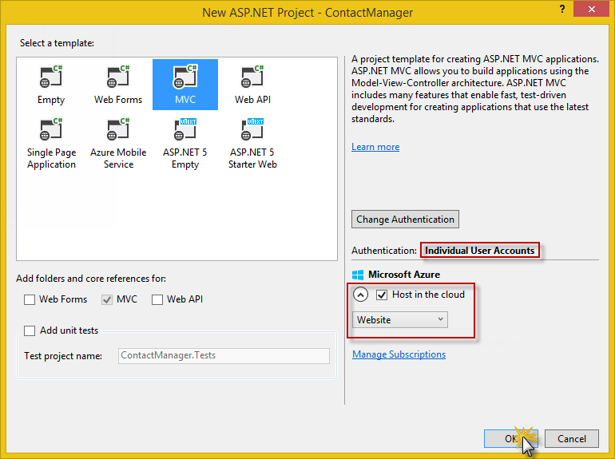
	
    _New ASP.NET Project dialog box_

5. If you haven't already signed in to Azure, Visual Studio prompts you to do so. Click **Sign In**.

	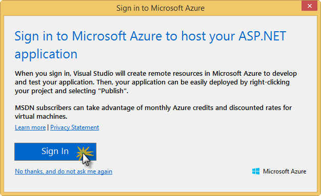
	
    _Sign in to Azure_

6. The configuration wizard will suggest a unique name based on *ContactManager* (see the image below). Select a region near you. You can use [azurespeed.com](http://www.azurespeed.com/ "AzureSpeed.com") to find the lowest latency data center.
7. If you haven't created a database server before, select **Create new server**, enter a database user name and password.

	
	
    _Configure Azure Website_

	If you have a database server, use that to create a new database. Database servers are a precious resource, and you generally want to create multiple databases on the same server for testing and development rather than creating a database server per database. Make sure your web site and database are in the same region.

	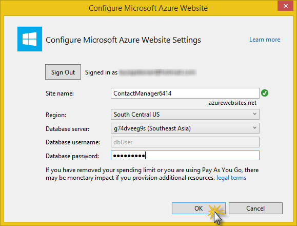
	
    _Configure Azure Website_

8. Click **OK**.

	In a few seconds, Visual Studio creates the web project in the folder you specified, and it creates the website in the Azure region you specified.

	The **Solution Explorer** window shows the files and folders in the new project.

	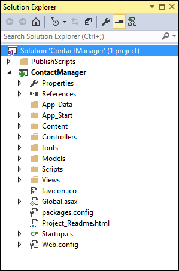
	
	_Solution Explorer_

	The **Web Publish Activity** window shows that the site has been created.

	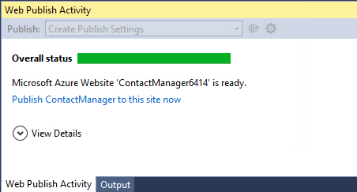
	
	_Web site created_

	And you can see the site and database in **Server Explorer**.

	> **Note:** if the Server Explorer window is not open, you can open it from the **View** menu.

	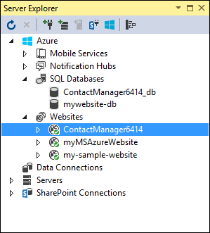
	
    _Web site created_

## Deploy the application to Azure

1. In the **Web Publish Activity** window, click **Publish ContactManager to this site now**.

	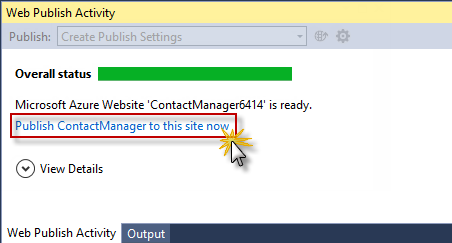
	
    _Web Publish Activity Window_

	In a few seconds the **Publish Web** wizard appears.

	The settings that Visual Studio needs to deploy your project to Azure have been saved in a *publish profile*. The wizard enables you to review and change those settings.

2. In the **Connection** tab of the **Publish Web** wizard, click **Validate Connection** to make sure that Visual Studio can connect to Azure in order to deploy the web project.

	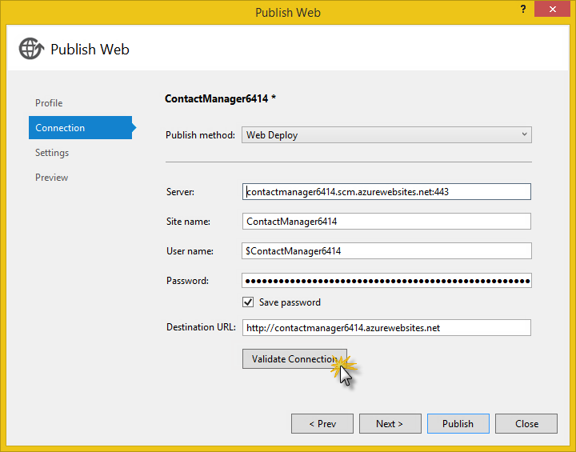
	
    _Validating the connection_

	When the connection has been validated, a green check mark is shown next to the **Validate Connection** button.

3. Click **Next**.

	
	
	_Successfully validated connection_
    
4. In the **Settings** tab, click **Next**.

	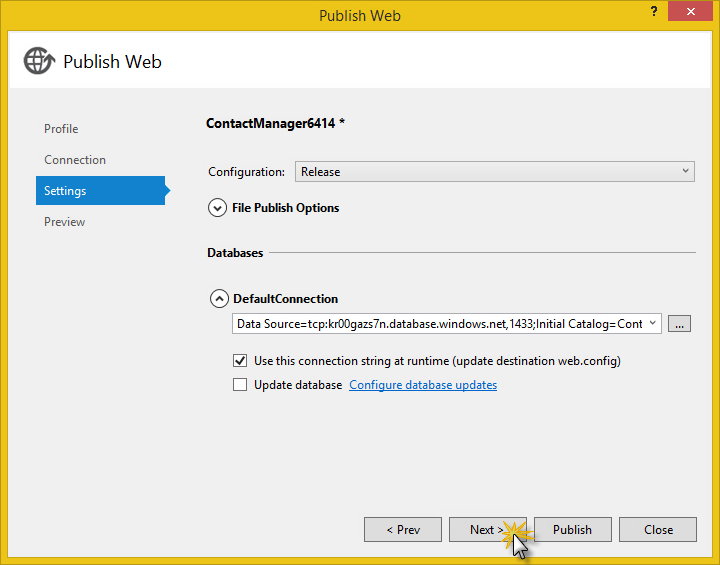
	
    _Settings tab_

	You can accept the default values for **Configuration** and **File Publish Options**.

	If you expand **File Publish Options** you will see several settings that enable you to handle scenarios that don't apply to this lab:

	* **Remove additional files at destination**.

		Deletes any files at the server that aren't in your project. You might need this if you were deploying a project to a site that you had deployed a different project to earlier.

	* **Precompile during publishing**.

		Can reduce first-request warm up times for large sites.

	* **Exclude files from the App_Data folder**.

		For testing you sometimes have a SQL Server database file in App_Data which you don't want to deploy to production.

5. In the **Preview** tab, click **Start Preview**.

	
	
	_Start Preview button - Preview tab_

	The tab displays a list of the files that will be copied to the server. Displaying the preview isn't required to publish the application but it's a useful function to be aware of.

6. Click **Publish**.

	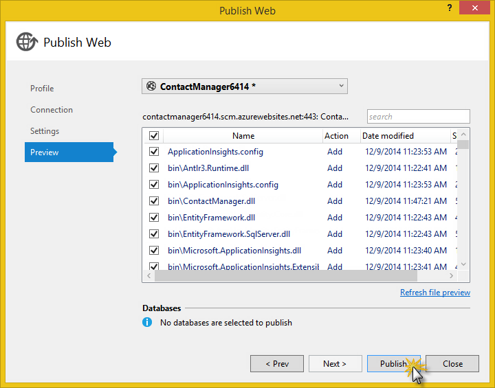
	
	_File Preview_

	Visual Studio begins the process of copying the files to the Azure server.

	The **Output** and **Web Publish Activity** windows show what deployment actions were taken and report successful completion of the deployment.

	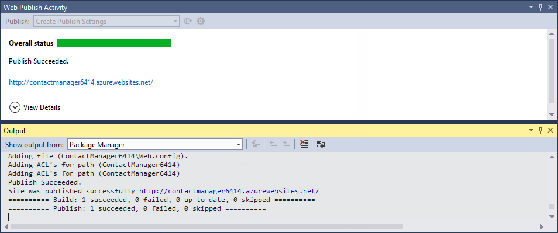
	
    _Output window reporting successful deployment_

	Upon successful deployment, the default browser automatically opens to the URL of the deployed website, and the application that you created is now running in the cloud. The URL in the browser address bar shows that the site is being loaded from the Internet.

	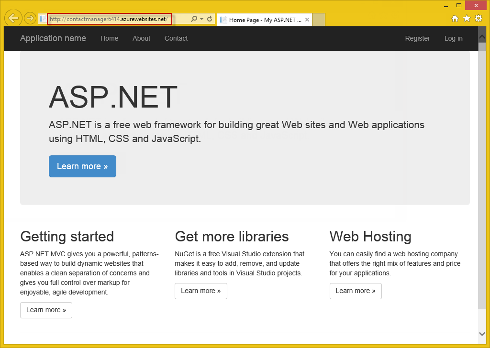
	
	_Web site running in Azure_

7. Close the browser.

## Make a change and redeploy

In this task, you will change the **h1** heading of the home page, run the project locally on your development computer to verify the change, and then deploy the change to Azure.

1. Open the *Views/Home/Index.cshtml* file in **Solution Explorer**, change the **h1** heading from "ASP.NET" to "ASP.NET and Azure", and save the file.

	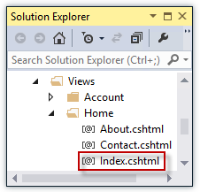
	
    _Index.cshtml_

	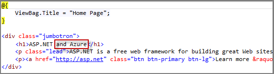
	
    _Changing the page's heading_

2. Press **CTRL+F5** to see the updated heading by running the site on your local computer.

	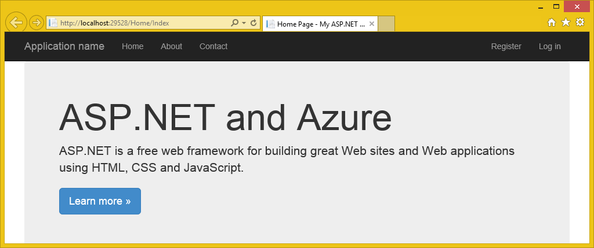
	
	_Web site running locally_
    
	The **http://localhost** URL shows that it's running on your local computer. By default it's running in IIS Express, which is a lightweight version of IIS designed for use during web application development.

3. Close the browser.

4. In **Solution Explorer**, right-click the project, and choose **Publish**.

	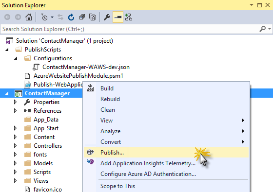
	
    _Preparing a new deployment_

	The Preview tab of the **Publish Web** wizard appears. If you needed to change any publish settings you could choose a different tab, but now all you want to do is redeploy with the same settings.

5. In the **Publish Web** wizard, click **Publish**.

	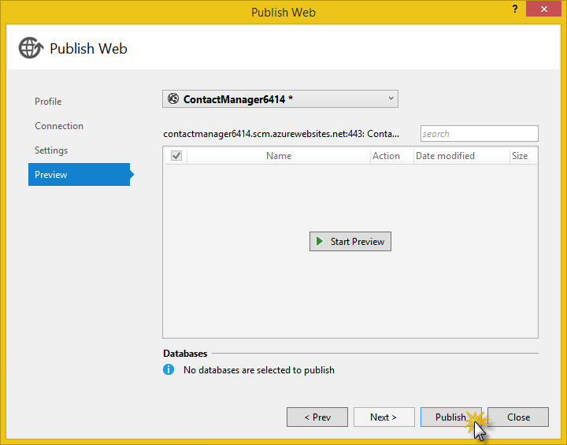
	
	_Publish Web Wizard_
    
	Visual Studio deploys the project to Azure and opens the site in the default browser.

	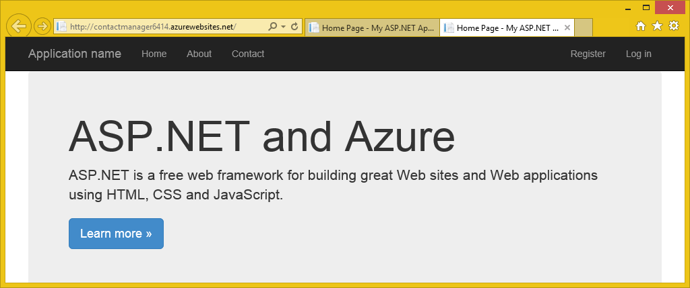
	
	_Changes deployed_

	>**Tip:** You can enable the **Web One Click Publish** toolbar for even quicker deployment. Click **View** > **Toolbars**, and then select **Web One Click Publish**. The toolbar enables you to select a profile, click a button to publish, or click a button to open the **Publish Web** wizard.

	
	
    _Web One Click Publish Toolbar_

## Monitor and manage the site in the management portal

The [Azure Management Portal](https://manage.windowsazure.com/) is a web interface that enables you to manage and monitor your Azure services, such as the website you just created. In this task you will look at some of what you can do in the portal.

1. In your browser, go to [http://manage.windowsazure.com](http://manage.windowsazure.com), and sign in with your Azure credentials.

	The portal displays a list of your Azure services.

2. Click the name of your website.

	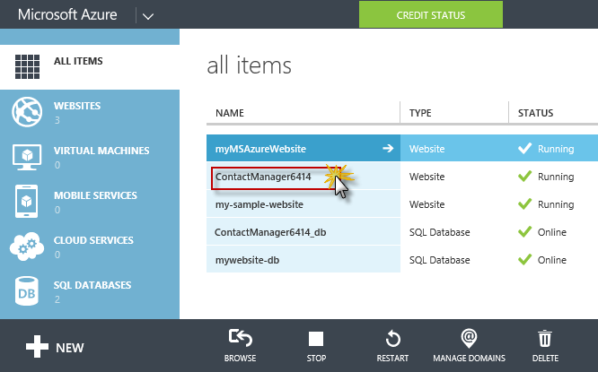

    _Portal Home Page_
  
3. Click the **Dashboard** tab.

	The **Dashboard** tab displays an overview of usage statistics and link for a number of commonly used site management functions. Under **Quick Glance** you will also find a link to your application's home page.

	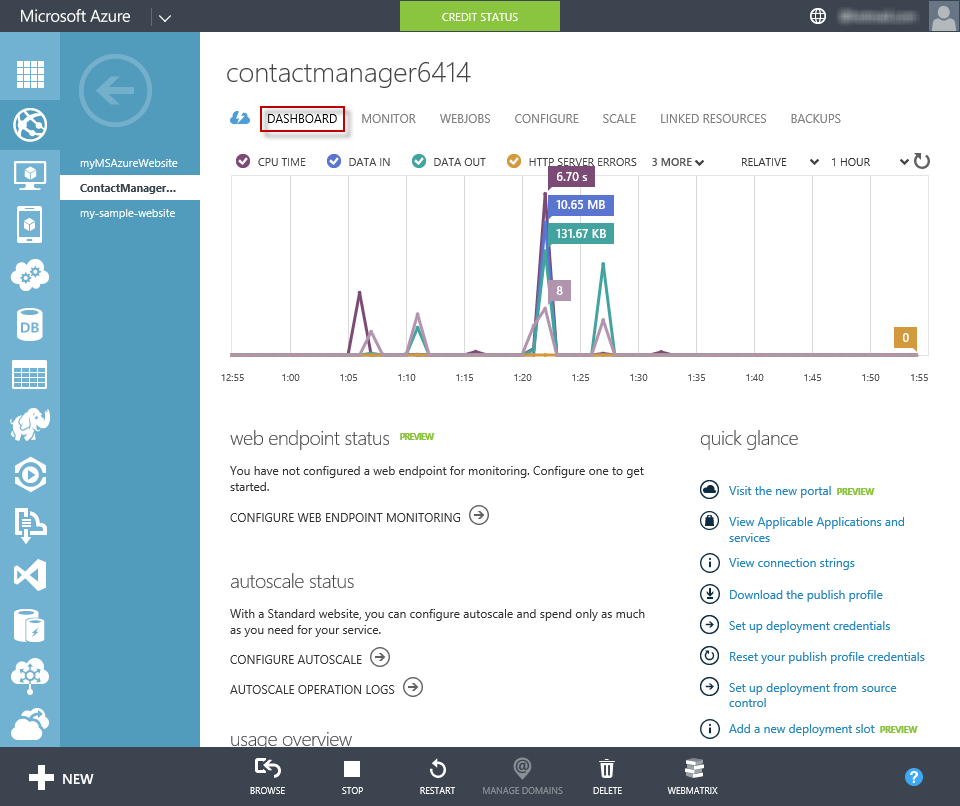

  	_Website's Dashboard_
    
	At this point your site hasn't had much traffic and may not show anything in the graph. If you browse to your application, refresh the page a few times, and then refresh the portal **Dashboard** page, you will see some statistics show up. You can click the **Monitor** tab for more details.

4. Click the **Configure** tab.

	The [Configure](http://azure.microsoft.com/en-us/documentation/articles/web-sites-configure/) tab enables you to control the .NET version used for the site, enable features such as [WebSockets](http://azure.microsoft.com/blog/2013/11/14/introduction-to-websockets-on-windows-azure-web-sites/) and [diagnostic logging](http://azure.microsoft.com/en-us/documentation/articles/web-sites-enable-diagnostic-log/), set [connection string values](http://azure.microsoft.com/blog/2013/07/17/windows-azure-web-sites-how-application-strings-and-connection-strings-work/), and more. 

	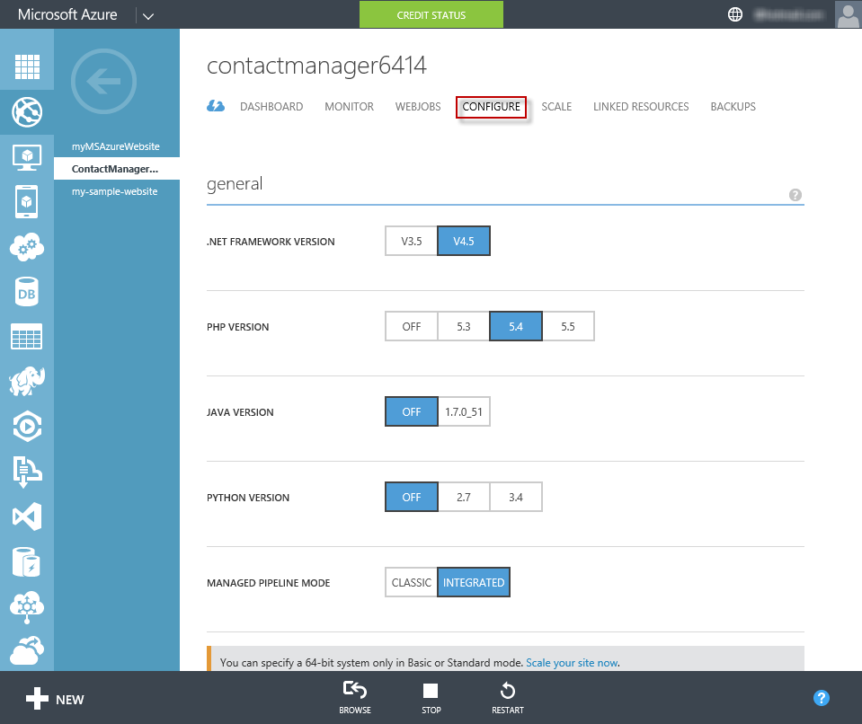
	
  	_Website's Configuration Panel_
    
5. Click the **Scale** tab.

	For the paid tiers of the Websites service, the [Scale](http://azure.microsoft.com/en-us/documentation/articles/web-sites-scale/) tab enables you to control the size and number of machines that service your web application in order to handle variations in traffic.

	You can scale manually or configure criteria or schedules for automatic scaling.

	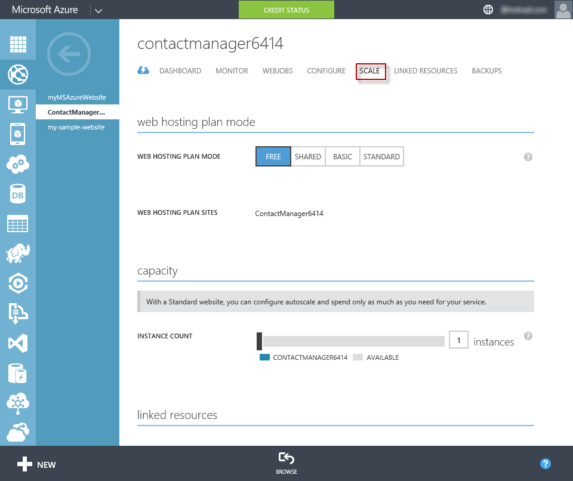
	
    _Website's Scale Options_

	These are just a few of the management portal features. You can also create new websites, delete existing sites, stop and restart sites, and manage other kinds of Azure services, such as databases and virtual machines.

	**Tip:** There is a new management portal in preview which will eventually replace the one you've been using. For more information, see [Azure Preview Portal](http://azure.microsoft.com/en-us/overview/preview-portal/).

## Summary

In this lab you have seen how to create a simple web application and deploy it to an Azure Website. You also made a quick tour around the Azure Management Portal.